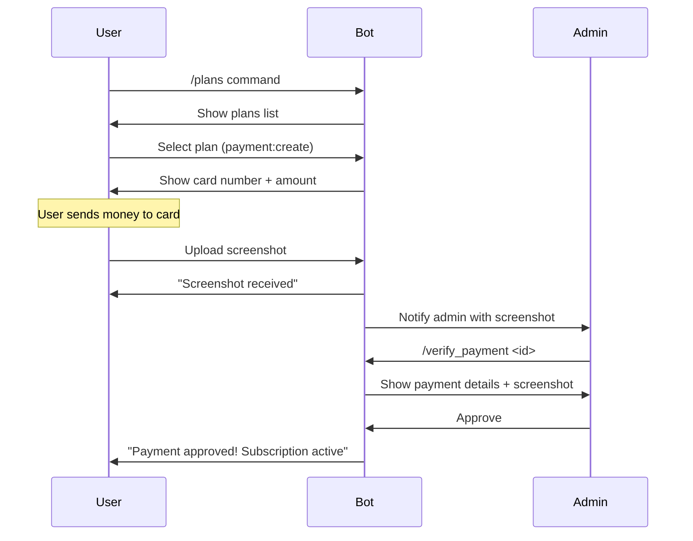

# Manual Payment System - Setup & Migration Guide

## Overview

This document describes how to set up and use the new **Manual Payment System** that replaces the online payment providers (CryptoPay, NOWPayments, Stripe).

## What Changed

### Replaced Components

| Old Component | New Component |
|---------------|---------------|
| `payment_logs` table | `manual_payments` table |
| Online payment webhooks | Manual admin verification |
| CryptoPay/Stripe APIs | Admin card-based payment |
| Automatic subscription activation | Manual approval by admin |

### New Database Table

**`manual_payments`** - Stores manual payment requests with screenshots

```sql
CREATE TABLE manual_payments (
  id BIGSERIAL PRIMARY KEY,
  user_id BIGINT NOT NULL REFERENCES users(id),
  plan_id INTEGER NOT NULL REFERENCES plans(id),
  verified_by BIGINT REFERENCES users(id),
  amount_cents INTEGER NOT NULL,
  currency VARCHAR(3) DEFAULT 'USD',
  status manual_payment_status NOT NULL DEFAULT 'awaiting_screenshot',
  screenshot_file_id VARCHAR(256),
  screenshot_file_unique_id VARCHAR(256) NOT NULL,
  screenshot_file_path VARCHAR(512),
  screenshot_mime_type VARCHAR(100),
  screenshot_file_size_bytes INTEGER,
  payment_reference VARCHAR(256),
  user_note TEXT,
  admin_note TEXT,
  rejection_reason TEXT,
  subscription_id BIGINT REFERENCES subscriptions(id),
  ip_address VARCHAR(45),
  screenshot_received_at TIMESTAMPTZ,
  verified_at TIMESTAMPTZ,
  expires_at TIMESTAMPTZ,
  created_at TIMESTAMPTZ DEFAULT NOW(),
  updated_at TIMESTAMPTZ DEFAULT NOW()
);
```

## Environment Variables

Add these to your `.env` file:

```bash
# =================================================================
# Manual Payment Configuration
# =================================================================

# Admin's card details for payments
ADMIN_CARD_NUMBER=1234567890123456
ADMIN_CARD_HOLDER=Admin Name

# Payment expiry time (in hours)
MANUAL_PAYMENT_EXPIRY_HOURS=24

# Maximum screenshot size (in MB)
MAX_SCREENSHOT_SIZE_MB=10
```

## New Payment Flow

### 1. User Flow



### 2. Bot Commands

#### User Commands
- `/plans` - Browse available plans
- Click "Buy" button → Creates manual payment
- Upload screenshot → Attaches to payment
- Optional: Add transaction ID

#### Admin Commands
- `/admin` or `/payments` - Admin panel
- `/verify_payment <payment_id>` - View payment details
- Approve/Reject via buttons

### 3. Payment Statuses

| Status | Description |
|--------|-------------|
| `awaiting_screenshot` | Payment created, waiting for screenshot |
| `pending` | Screenshot received, awaiting verification |
| `approved` | Payment verified, subscription created |
| `rejected` | Payment rejected by admin |
| `expired` | Payment expired (24h default) |

## API Endpoints

### User Endpoints

```
POST   /api/payments                    # Create manual payment
GET    /api/payments/:id                # Get payment details
GET    /api/payments                    # Get user's payments
GET    /api/payments/:id/status          # Check payment status
POST   /api/payments/:id/reference       # Set transaction ID
POST   /api/payments/:id/cancel          # Cancel payment
```

### Admin Endpoints

```
GET    /api/payments/admin/pending       # Get pending payments
GET    /api/payments/admin/pending/count # Get pending count
POST   /api/payments/admin/:id/verify     # Approve/reject payment
GET    /api/payments/admin/:id            # Get payment details (admin)
```

## Database Migration

Run this migration to create the new table:

```sql
-- Create manual_payment_status enum
CREATE TYPE manual_payment_status AS ENUM (
  'pending',
  'awaiting_screenshot',
  'approved',
  'rejected',
  'expired'
);

-- Create manual_payments table
CREATE TABLE manual_payments (
  id BIGSERIAL PRIMARY KEY,
  user_id BIGINT NOT NULL REFERENCES users(id) ON DELETE CASCADE,
  plan_id INTEGER NOT NULL REFERENCES plans(id),
  verified_by BIGINT REFERENCES users(id),
  amount_cents INTEGER NOT NULL,
  currency VARCHAR(3) DEFAULT 'USD',
  status manual_payment_status NOT NULL DEFAULT 'awaiting_screenshot',
  screenshot_file_id VARCHAR(256),
  screenshot_file_unique_id VARCHAR(256) NOT NULL,
  screenshot_file_path VARCHAR(512),
  screenshot_mime_type VARCHAR(100),
  screenshot_file_size_bytes INTEGER,
  payment_reference VARCHAR(256),
  user_note TEXT,
  admin_note TEXT,
  rejection_reason TEXT,
  subscription_id BIGINT REFERENCES subscriptions(id),
  risk_score DECIMAL(3,2) DEFAULT 0,
  screenshot_received_at TIMESTAMPTZ,
  verified_at TIMESTAMPTZ,
  expires_at TIMESTAMPTZ,
  created_at TIMESTAMPTZ DEFAULT NOW(),
  updated_at TIMESTAMPTZ DEFAULT NOW()
);

-- Create indexes
CREATE INDEX idx_manual_payments_user_id ON manual_payments(user_id);
CREATE INDEX idx_manual_payments_plan_id ON manual_payments(plan_id);
CREATE INDEX idx_manual_payments_status ON manual_payments(status);
CREATE INDEX idx_manual_payments_verified_by ON manual_payments(verified_by);
CREATE INDEX idx_manual_payments_created_at ON manual_payments(created_at);
CREATE INDEX idx_manual_payments_expires_at ON manual_payments(expires_at);
CREATE INDEX idx_manual_payments_pending ON manual_payments(id, user_id, created_at)
  WHERE status = 'pending' AND screenshot_file_id IS NOT NULL;
```

## Files Modified/Created

### New Files
- `src/db/schema/manual-payments.ts` - Manual payments table schema
- `src/services/manual-payment.ts` - Manual payment service

### Modified Files
- `src/db/schema/enums.ts` - Added `manualPaymentStatusEnum`
- `src/db/schema/index.ts` - Export manual payments schema
- `src/db/queries.ts` - Added manual payment queries
- `src/config/index.ts` - Added manual payment config
- `src/bot/handlers/payment.ts` - Rewritten for manual payments
- `src/bot/handlers/admin.ts` - New admin verification handler
- `src/bot/index.ts` - Added admin handlers & screenshot handling
- `src/routes/api/payments.ts` - Updated API routes

## Testing

### Test User Flow

1. Start the bot: `/start`
2. View plans: `/plans`
3. Select a plan → Click "Buy"
4. Note the card number and amount
5. Click "Send Screenshot" and upload an image
6. Optionally add transaction ID
7. Wait for admin approval

### Test Admin Flow

1. Use `/admin` or `/payments` command
2. View pending payments
3. Use `/verify_payment <id>` to review
4. Approve or Reject the payment
5. User gets notification

## Screenshots Storage

Screenshots are stored by Telegram. The `screenshot_file_id` is used to:
- Display screenshot to admin during verification
- Forward screenshot between admins
- Retrive screenshot if needed

To enable local storage, you can download files using:
```typescript
const file = await ctx.api.getFile(fileId)
const buffer = await fetch(`https://api.telegram.org/file/bot${token}/${file.file_path}`)
```

## Security Considerations

1. **Card Number Protection**: Only admins should see `ADMIN_CARD_NUMBER`
2. **Screenshot Validation**: File type and size validation
3. **Payment Expiry**: Automatic expiry after configured hours
4. **Rate Limiting**: Consider limiting payment creation per user
5. **Audit Trail**: All verifications are logged with admin ID

## Troubleshooting

### Issue: Screenshot not uploading
- Check file size (max 10MB by default)
- Check file type (only jpg, png, webp)
- Verify user has pending payment in session

### Issue: Admin not notified
- Check `TELEGRAM_ADMIN_IDS` in config
- Verify admin hasn't blocked the bot
- Check bot has permission to message admins

### Issue: Subscription not created after approval
- Check Marzban API connection
- Verify server availability
- Check logs for errors

## Migration from Online Payments

To completely disable online payments:

1. Remove payment provider credentials from `.env`:
   ```
   # CRYPTOPAY_API_KEY=
   # NOWPAYMENTS_API_KEY=
   # STRIPE_SECRET_KEY=
   ```

2. Remove webhook handlers (optional):
   - Delete `src/routes/webhooks.ts` payment webhooks
   - Or comment out webhook routes

3. Update plans to show manual payment only

## Future Enhancements

Potential improvements:
- Bulk approve multiple payments
- Add notes during verification
- Export payment reports
- Integration with banking apps for faster verification
- QR code payments support
- Multiple payment methods per user
